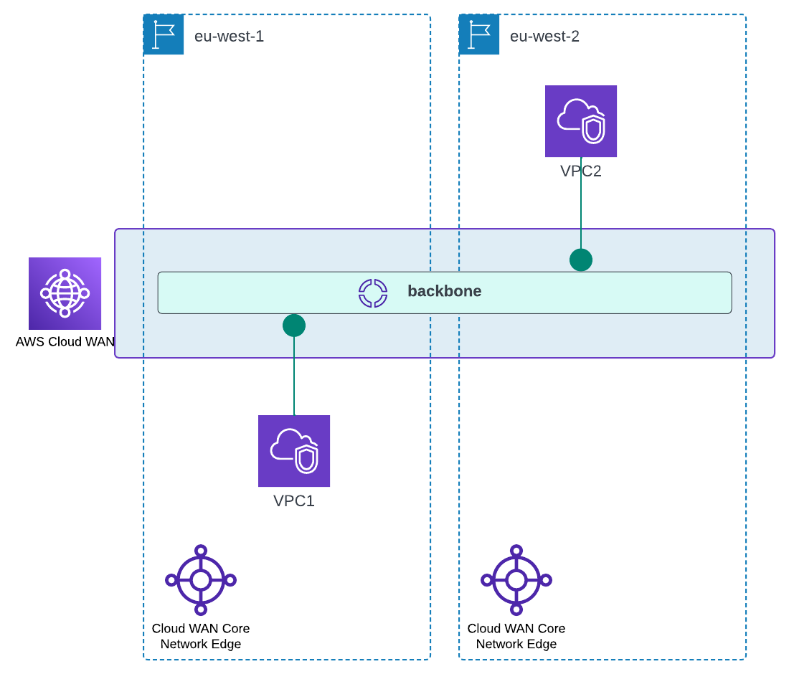

# AWS CloudWAN demo

This is a simple demo showing how to setup an AWS CloudWAN network between two regions.

### Assumption
You have some basic knowledge of Terraform and networking. Please fill in the required variables and Terrform backend information otherwise just run locally.

The demo is being set up in eu-west-1 (Ireland) and eu-west-2 (London) regions.
Creates a global network. We create two VPCs, one in each region and connect them to the core network.
Once connected, instances running in the two VPCs are able to ping each other.

## Important Note
This demo deploys multiple AWS resources which are not included in AWS Free tier, so expect some costs.
Please refer to the pricing pages of Amazon VPC and CloudWAN to figure out the prices.

## Top level diagram


## Deploying
```
$ terraform init
$ terraform plan
$ terraform apply -auto-approve
```

## Testing
SSM is automatically installed in Spot EC2 instance running in both the VPCs.
SSM into instance in VPC1 and try to ping the private IP of the instance in VPC2. Eureka!
Have fun :)

## Destroying
Done playing?
```
$ terraform destroy -auto-approve
```

## Troubleshooting
If you find `terraform apply` failing after running for a while for the first time, try running the command again.
This happens because AWS is taking time in the background to setup core-network and core-network attachments.
You can also try increase the timeout time for creation of core-network.
