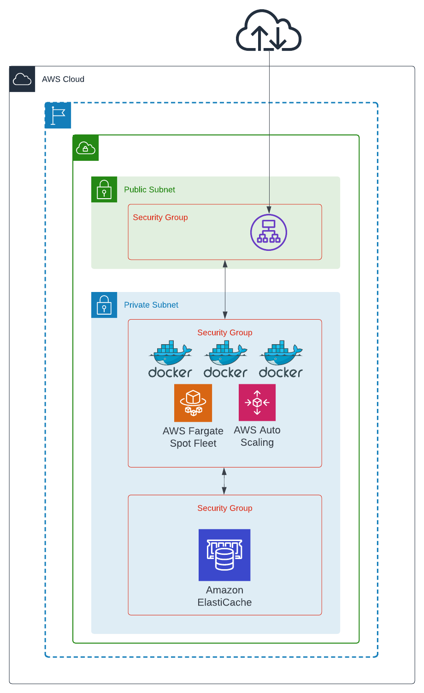

# ECS deployment for a simple application

## Application
A simple Python Flask based application that simply hosts a webpage
showing SOURCE IP address, SERVER IP address, visitor count and AWS Region the application is running from

Application could be run locally using the docker-compose file.
```
$ cd demos/tree/main/terraform/aws-ecs-application
$ docker-compuse up --build
```
## Top level diagram


## Infrastructure
Application is deployed into an AWS ECS Cluster. The Terraform files are located under `infra` directory
```
$ terraform init
$ terraform plan
$ terraform apply -auto-approve
```

### Important Note
This demo deploys multiple AWS resources which are not included in AWS Free tier, so expect some costs
Please refer to the pricing pages of Amazon VPC, ECS and Elasticache to figure out the prices.

### Accessing the application
From the AWS console find the DNS of the load-balancer created by Terraform
Try to access it using the web browser `http://<ALB_DNS>`

### Destroying
Done playing?
```
$ terraform destroy -auto-approve
```