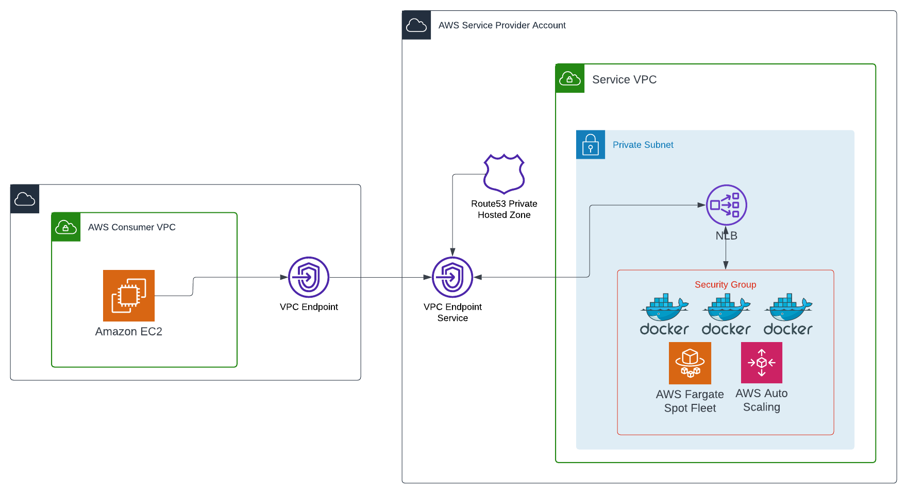
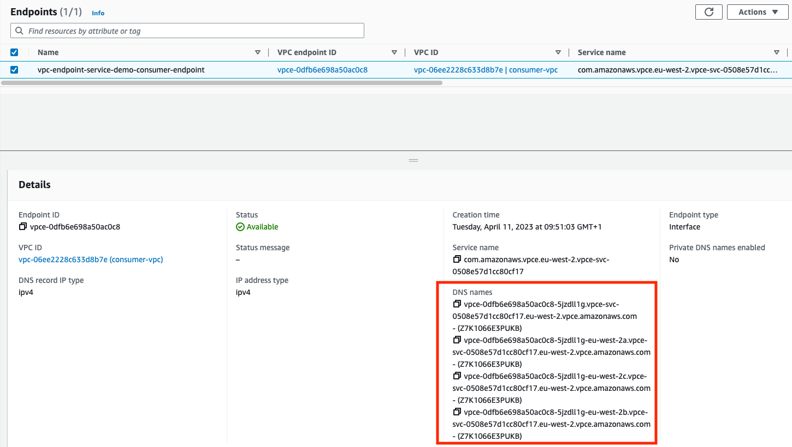

# AWS PrivateLink (VPC Endpoint Service)

## Application
The application is a ChatGPT generated python code for an e-commerce backend API. The API exposes three endpoints
- `/products` GET endpoint for listing the entire inventory
- `/products/<product_id>` GET endpoint for getting a specific product by ID
- `/orders` POST endpoint to create a new order

Application could be run locally using the docker-compose file.
```
$ cd demos/terraform/vpc-endpoint-service
$ docker-compuse up --build
```

## Top level diagram


### Service Provider
The API runs in containers being executed on Fargate. In the demo the API is scaled to three instances. Please keep in mind the API is just a demo code and does not have a persistent storage, so GET calls after POST may not get desired results. API is deployed in a service VPC within AWS.

The API is behind a Network Load Balancer (NLB). There is a private hosted zone (internal.com) in Route53 which creates a private DNS for the NLB within the service VPC. The API is available within the service VPC with a DNS `vpc-endpoint-service-demo.internal.com`.

The API's NLB is exposed to consumer VPC using AWS PrivateLink.
```
resource "aws_vpc_endpoint_service" "endpoint_service" {
  acceptance_required        = false
  network_load_balancer_arns = [aws_lb.lb.arn]
  # private_dns_name = "${local.system_key}.example.com"

}
```

### Consumer
The consumer is an EC2 instance trying to reach the e-commerce backend API from a different VPC (could be same or different account). The consumer creates a VPC Endpoint using 

```
resource "aws_vpc_endpoint" "service_endpoint_for_consumer" {
  vpc_id            = module.vpc_consumer.vpc_id
  service_name      = aws_vpc_endpoint_service.endpoint_service.service_name
  vpc_endpoint_type = "Interface"
  subnet_ids = module.vpc_consumer.private_subnets

  security_group_ids = [
    aws_security_group.vpce_security_group.id,
  ]

  # private_dns_enabled = true
}
```

### Private DNS
If you have a domain at hand, you could try putting it under the commented code to have a private DNS as well.

## Infrastructure
Application is deployed into an AWS ECS Cluster. The Terraform files are located under `infra` directory
```
$ terraform init
$ terraform plan
$ terraform apply -auto-approve
```

### Important Note
This demo deploys multiple AWS resources which are not included in AWS Free tier, so expect some costs
Please refer to the pricing pages of Amazon VPC, ECS and Elasticache to figure out the prices.

### Testing
Terraform creates two VPCs and an instance in each VPC.
- `vpc-consumer.tf` creates consumer VPC and `instance-consumer-vpc.tf` creates a consumer EC2 instance
- `vpc-service.tf` creates a service provider VPC and `instance-service-vpc.tf` create an EC2 instance inside the service VPC

SSM into the EC2 instance inside the service provider VPC and try to reach the API service from the internal DNS
```
# curl http://vpc-endpoint-service-demo.internal.com/products
[
  {
    "description": "Description for product 1",
    "id": 1,
    "name": "Product 1",
    "price": 9.99,
    "quantity": 10
  },
  {
    "description": "Description for product 2",
    "id": 2,
    "name": "Product 2",
    "price": 19.99,
    "quantity": 5
  },
  {
    "description": "Description for product 3",
    "id": 3,
    "name": "Product 3",
    "price": 29.99,
    "quantity": 2
  }
]
```
This DNS is only available within the service VPC since we have not added a custom domain.

Now, SSM into the EC2 instance of the consumer VPC and try the same. This time it won't work because the domain is only available inside the service VPC. To access the API we have to go through the PrivateLink i.e. VPC endpoint for the target service. To find out the DNS, go to the AWS console -> VPC -> Endpoints and select the endpoint created by Terraform. 


Now try accessing the service API using any DNS highlighted in red. You should be able to access the API exposed through AWS PrivateLink
```
# curl vpce-xxxx.eu-west-2.vpce.amazonaws.com/products/2
{
  "description": "Description for product 2",
  "id": 2,
  "name": "Product 2",
  "price": 19.99,
  "quantity": 5
}
```

### Destroying
Done playing?
```
$ terraform destroy -auto-approve
```